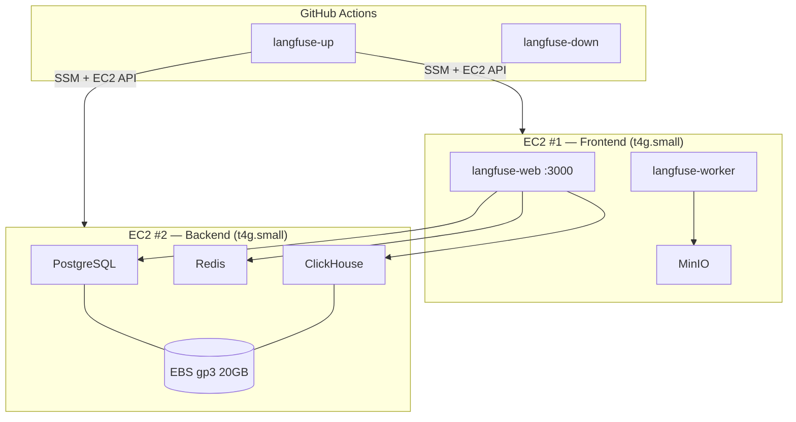

# langfuse-on-ec2

> **This project is intended for PoC / development use only.**
> It is NOT designed for production workloads. The author assumes no responsibility for any damages, data loss, or security incidents arising from the use of this project in a production environment. Use at your own risk.

Langfuse v3 を EC2 × 2台 + docker-compose でセルフホストする構成です。
AWS CDK でインフラを構築し、GitHub Actions でワンクリック起動・停止できます。

## 構成



| | EC2 #1 (Frontend) | EC2 #2 (Backend) |
|---|---|---|
| コンテナ | langfuse-web, langfuse-worker, MinIO | PostgreSQL, Redis, ClickHouse |
| EBS | root 10GB | root 10GB + data 20GB |
| 性質 | ステートレス | ステートフル（データ永続化） |

## コスト

EC2 t4g.small には無料枠（月750時間、2026年12月末まで）があります。使う時だけ起動する運用であれば、2台合算でも月375時間（平日8時間 × 23日）まで無料です。停止中は EBS の料金のみ発生します。

## 前提条件

- AWS アカウント + AWS CLI（SSO ログイン済み）
- Node.js 18+
- AWS CDK v2（`npm install -g aws-cdk`）
- CDK Bootstrap 済み（`cdk bootstrap aws://<ACCOUNT_ID>/ap-northeast-1`）
- GitHub リポジトリ（フォークまたはクローン）

## セットアップ

### 1. CDK デプロイ

```bash
cd infra
npm install

# Langfuse インフラをデプロイ
cdk deploy langfuse-dev

# GitHub Actions OIDC 連携をデプロイ（リポジトリ名を指定）
cdk deploy langfuse-github-oidc-dev -c repo=<YOUR_GITHUB_USER>/langfuse-on-ec2
```

デプロイ完了後、以下の出力を控えてください。

- `langfuse-github-oidc-dev.RoleArn` — GitHub Actions 用の IAM ロール ARN

### 2. GitHub シークレットの設定

リポジトリの Settings > Secrets and variables > Actions に以下を追加します。

| シークレット名 | 値 |
|---|---|
| `AWS_OIDC_ROLE_ARN` | 手順1で出力された Role ARN |

### 3. Langfuse の起動

GitHub リポジトリの Actions タブから `Langfuse Up` を実行します。
起動完了後、Summary に表示される URL (`http://<IP>:3000`) にアクセスしてください。

初回アクセス時に管理者アカウントを作成し、Organization と Project をセットアップします。

## GitHub Actions Workflow

| Workflow | 説明 |
|---|---|
| `Langfuse Up` | Backend → DB ヘルスチェック → Frontend の順で起動。URL を Summary に表示 |
| `Langfuse Down` | Frontend → Backend の順で graceful shutdown。EBS データは保持 |
| `Langfuse Status` | 両 EC2 の状態と Langfuse のヘルスチェック結果を表示 |

## ディレクトリ構成

```
.github/workflows/     GitHub Actions (起動・停止・状態確認)
infra/
  bin/app.ts           CDK エントリポイント
  lib/
    langfuse-stack.ts  EC2 × 2台 + SG + SSM Parameter
    github-oidc-stack.ts  GitHub OIDC 連携
    config.ts          共通設定
  test/                CDK テスト
langfuse/
  backend/docker-compose.yml   PostgreSQL + Redis + ClickHouse
  frontend/docker-compose.yml  langfuse-web + langfuse-worker + MinIO
```

## 削除

```bash
cd infra
cdk destroy langfuse-github-oidc-dev
cdk destroy langfuse-dev
```

EBS ボリュームに保存された Langfuse のデータも削除されます。
